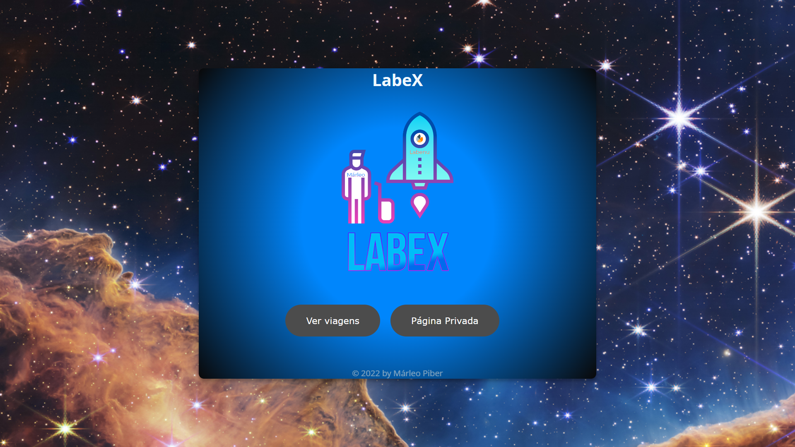
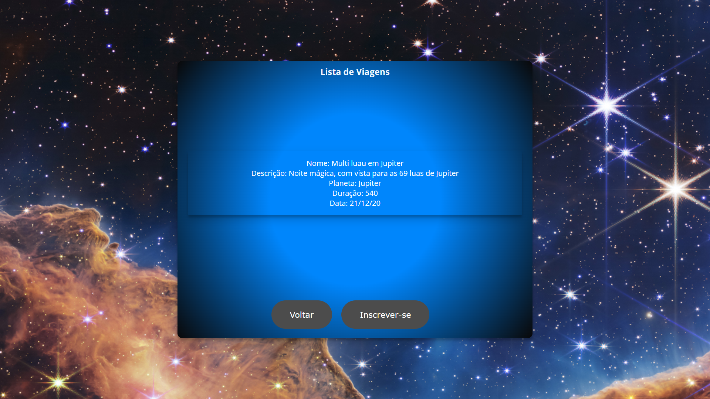
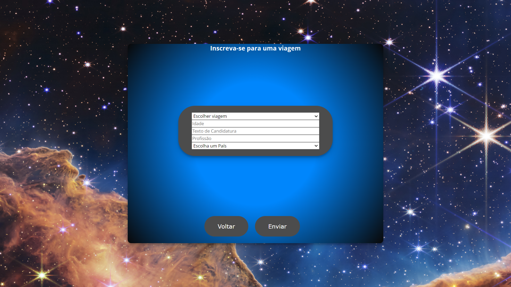
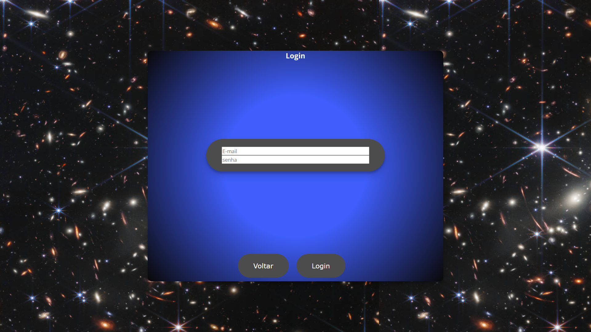
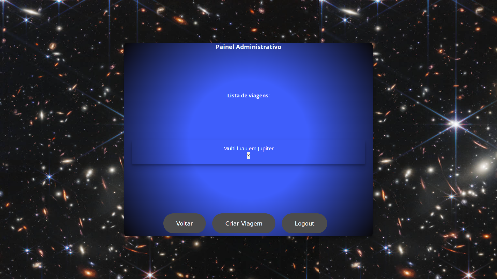

# Projeto:
Site LabeX

# Link do Surge:
https://labex-marleo.surge.sh/

# Descrição:
O site Labex simula um sistema de gerenciamento de viagens espaciais.

## O que funciona:
As rotas estão todas funcionando;
Você consegue realizar login e logout atráves do email:
marleopr@gmail.com
senha: 123456
Assim conseguindo acesso a área restrita do site.

## O que não funciona:
A página criar viagem não cria viagens;
A página de detalhes da viagem não funciona;
Não consigo adicionar viagens pelo código nem pelo postman.

# Tecnologias utilizadas:

# Autor:
Márleo Piber da Rosa;

  
# Imagens:
####Tela inicial:

####Parte pública:
####Página de viagens disponíveis:

####Página de inscrição para viagens:

####Página Privada:
####Página de Login:

####Painel administrativo:
